<p align="right">
  
</p>
<h1 align="center">SALAWUDEEN IBRAHIM</h1>

<h2 align="center">Project Introduction</h2>

This project presents the **design** and **implementation of a Student Course Registration System using a relational database model**. It aims to simulate how a fictional university manages student registrations, course offerings, instructor assignments, prerequisites, and academic records. The system is built entirely with **SQL**, covering schema design, table creation, constraints enforcement, and data manipulation.

To reflect real-world scenarios, the dataset includes **manually generated dummy data featuring null values, empty fields, and duplicate entries, enabling a realistic environment for practicing data analysis and integrity checks**. Core components of the project include an **Entity-Relationship Diagram (ERD)**, **SQL scripts for database creation**, **sample data population**, and **practical query operations**. The project emphasizes **data integrity**, **normalization, and the use of SQL for efficient information retrieval and validation**, making it a strong foundation for understanding database systems in academic or enterprise environments.

## 🎯 Aim
To design and implement a robust relational database system that effectively manages student registrations, course offerings, instructor assignments, and academic performance, while simulating real-world data scenarios involving missing values, nulls, and duplicate records, using SQL for data modeling, manipulation, and analysis.

## 🧩 Problem Statement
Modern universities manage thousands of students, courses, instructors, and class enrollments each semester. Without a centralized system, tracking course offerings, managing student registrations, assigning instructors, and recording grades becomes inefficient and error-prone. This project aims to design and implement a relational database that addresses these challenges by providing a structured way to:

- Store and manage student information.

- Maintain a catalog of courses and prerequisites.

- Track course offerings for each semester.

- Record instructor assignments.

- Handle student course registrations and grades.

## 📌 Methodology
For this SQL project, this include:

### Schema design using ER diagrams

- Identify key entities (e.g., Students, Courses, Instructors).

- Define attributes for each entity (e.g., StudentID, CourseTitle).

- Establish relationships (e.g., Students enroll in Courses).

- Create an Entity-Relationship Diagram (ERD) to visually model the data structure.

- ERDs help avoid redundancy and ensure normalization.

### SQL implementation (CREATE, INSERT, SELECT, etc.)
Convert the ERD into SQL code using:

- CREATE TABLE to define structure.

- PRIMARY KEY, FOREIGN KEY, CHECK, NOT NULL, and UNIQUE for integrity.

- Use INSERT statements to populate the tables with data.

- Run SELECT, UPDATE, DELETE, and JOIN queries to interact with data.

### Manual data generation (including nulls, duplicates)
Generate sample data to simulate real-world scenarios.

- Introduce:

- Nulls to test optional fields.

- Duplicates to test constraints or error handling.

- Insert both valid and edge-case values to verify data behavior.

### Query writing for analysis
Write SQL queries to:

- Analyze student grades, course offerings, instructor schedules.

- Track enrollments, course popularity, and performance trends.

- Use advanced SQL techniques like:

  GROUP BY, HAVING, ORDER BY

  Aggregates (COUNT, AVG, SUM)

  Views and subqueries

  graph TD
    A[Schema Design (ERD)] --> B[SQL Implementation]
    B --> C[Manual Data Generation]
    C --> D[Query Writing & Analysis]

## ✅ Objectives

### 1. Analyze the Problem Domain

#### Identify key entities (e.g., Students, Courses, Enrollments) and define their relationships and data requirements.
  
  | Entity              | Description                                                        | Key Attributes                                       |
| ------------------- | ------------------------------------------------------------------ | ------------------------------------------------------ |
| **Students**        | Individuals who enroll in the university and register for courses. | StudentID, FirstName, LastName, Email, Major, Year     |
| **Courses**         | Abstract course definitions offered by departments.                | CourseID, CourseCode, Title, Credits, Department       |
| **Instructors**     | Faculty members responsible for teaching courses.                  | InstructorID, FirstName, LastName, Email, Department   |
| **CourseOfferings** | Specific instances of courses taught in a semester.                | OfferingID, CourseID, Semester, InstructorID, Schedule |
| **Enrollments**     | Records of students registering for specific course offerings.     | EnrollmentID, StudentID, OfferingID, Grade, Date       |
| **Prerequisites**   | Courses that must be completed before enrolling in another course. | CourseID, PrerequisiteID                               |


  1. Students ↔ Enrollments
     Type: One-to-Many
     Explanation: A single student can enroll in multiple course offerings, but each enrollment record refers to only one student.
     Implementation: StudentID in Enrollments is a foreign key referencing Students.

  2. Courses ↔ CourseOfferings
     Type: One-to-Many
     Explanation: Each course can be offered in different semesters (e.g., CS101 may be offered in Fall and Spring).
     Implementation: CourseID in CourseOfferings is a foreign key referencing Courses.

  3. Instructors ↔ CourseOfferings
     Type: One-to-Many
     Explanation: One instructor can teach multiple course offerings.
     Implementation: InstructorID in CourseOfferings is a foreign key referencing Instructors.

  4. CourseOfferings ↔ Enrollments
     Type: One-to-Many
     Explanation: A course offering can have many students enrolled, but each enrollment belongs to only one offering.
     Implementation: OfferingID in Enrollments is a foreign key referencing CourseOfferings.

  5. Courses ↔ Prerequisites
     Type: Many-to-Many (Self-Referencing)
     Explanation: A course can have multiple prerequisites, and a course can be a prerequisite for multiple other courses.
     Implementation: Prerequisites table acts as a bridge with composite keys CourseID and PrerequisiteID.
     

| Relationship                     | Cardinality | Description                                                   |
| -------------------------------- | ----------- | ------------------------------------------------------------- |
| **Student → Enrollments**        | 1 : Many    | One student can enroll in many course offerings               |
| **Course → CourseOfferings**     | 1 : Many    | One course can have many offerings                            |
| **Instructor → CourseOfferings** | 1 : Many    | One instructor can teach multiple offerings                   |
| **CourseOffering → Enrollments** | 1 : Many    | Each offering has many students                               |
| **Course ↔ Prerequisites**       | Many : Many | A course can have multiple prerequisites (self-join)          |
| **Student ↔ Course (indirect)**  | Many : Many | Students register for courses through offerings + enrollments |                

| **Student → CourseOfferings**               | Many-to-Many (via Enrollments)                   | Students register for course offerings through the Enrollments table.           |
| **Student → Courses**                       | Many-to-Many (via CourseOfferings & Enrollments) | Students take courses indirectly through course offerings and enrollments.      |
| **Student → Prerequisites (via Courses)**   | Indirect                                         | Students must complete prerequisite courses before enrolling in some courses.   |
| **Student → Instructors**                   | Indirect (via CourseOfferings)                   | Students are taught by instructors assigned to course offerings they enroll in. |


#### Data understanding
  
  To simulate a realistic environment for the Student Course Registration System, synthetic data was manually generated for each table. Each table contains 500 rows, designed to include various data quality challenges such as null values, empty cells, and duplicates, 
  which reflect real-world database inconsistencies and provide a solid foundation for data integrity enforcement and validation through SQL.
  Below is a breakdown of each table, its key attributes, and its structure:
  

  | Table Name       | Number of Rows | Number of Columns  |  Key Columns                                                  |
|--------------------|----------------|--------------------|---------------------------------------------------------------|
| **Students**        | 500            | 7                  | StudentID, FirstName, LastName, Email, Phone, Major, Year    |
| **Courses**         | 500            | 5                  | CourseID, CourseCode, Title, Credits, Department             |
| **Instructors**     | 500            | 5                  | InstructorID, FirstName, LastName, Email, Department         |
| **CourseOfferings** | 500            | 5                  | OfferingID, CourseID, Semester, InstructorID, Schedule       |
| **Enrollments**     | 500            | 5                  | EnrollmentID, StudentID, OfferingID, EnrollmentDate, Grade   |
| **Prerequisites**   | 500            | 2                  | CourseID, PrerequisiteID                                     |


<div style="text-align: center; position: relative; display: inline-block;">

  <h3>📊 Click Through the Tables</h3>
  <p><em>Click the image to view the next table ➡️</em></p>

  <!-- Data icon badge -->
  <div style="
      position: absolute;
      top: 15px;
      left: 15px;
      background-color: rgba(255, 255, 255, 0.9);
      padding: 6px 12px;
      border-radius: 6px;
      font-size: 18px;
      font-weight: bold;
      box-shadow: 0 2px 4px rgba(0,0,0,0.2);">
    📋 Data Table
  </div>

  <!-- Image Carousel -->
  

  <p style="margin-top: 10px;">🔁 <strong>Keep clicking to cycle through all images</strong></p>
</div>

<script>
  const imagePaths = [
    "Student Course Registration System Report/Asset/Image/Student.jpg",
    "Student Course Registration System Report/Asset/Image/Course.jpg",
    "Student Course Registration System Report/Asset/Image/Instructor.jpg",
    "Student Course Registration System Report/Asset/Image/CourseOffering.jpg", 
    "Student Course Registration System Report/Asset/Image/Enrollment.jpg",
    "Student Course Registration System Report/Asset/Image/Prerequites.jpg"
  ];

 let currentImageIndex = 0;

  function cycleImage() {
    currentImageIndex = (currentImageIndex + 1) % imagePaths.length;
    document.getElementById("carousel").src = imagePaths[currentImageIndex];
  }
</script>

### 2.  Design an ERD (Entity-Relationship Diagram)
An Entity-Relationship Diagram (ERD) is a visual representation of the data and relationships in a database. It helps in designing the database structure before actual implementation. They are essential for planning, communicating, and building databases efficiently and correctly.

#### 1. Star Schema
The central fact table connects directly to multiple denormalized dimension tables. Dimension tables have redundant data but simplify queries with fewer joins while using Star Schema. use If the focus is on fast querying and reporting (like analyzing student enrollments, grades, course offerings), and simpler, flatter tables.

- Fact Table: Enrollments (records each registration with facts like Grade, EnrollmentDate)

- Dimension Tables: Students, Courses, Instructors, CourseOfferings, and Prerequites

**Note** All dimensions link directly to the fact table, and dimension tables are denormalized, meaning no further normalization (splitting) inside dimensions.


<div style="text-align: center; font-family: monospace; white-space: pre;">

         [Students]
               |
               |
[Instructors] — [Enrollments] — [Courses]
               |
           [CourseOfferings]

</div>


#### 2. Snowflake Schema

An extension of star schema where dimension tables are normalized into multiple related tables, reducing redundancy but increasing complexity and join operations. use If a more normalized structure to save storage space or maintain data integrity is needed, especially when dimension attributes have hierarchical relationships.

- Courses split into Courses and Departments (department becomes a separate table linked to Courses)

- Students may link to Majors table rather than storing major info directly

- Instructors linked to Departments similarly

- CourseOfferings could link to Semesters as a separate table

<div style="text-align: center; font-family: monospace; white-space: pre; margin-top: 20px;">

    [Departments]
       /        \
  [Courses]   [Instructors]
       \          /
     [CourseOfferings]
           |
       [Enrollments]
           |
       [Students]
           |
      [Prerequisites]

</div>


<div style="text-align: center;">
  
</div>


<div style="text-align: center; font-family: monospace; white-space: pre;">

  [Students]         [Instructors]         [Courses]
    |                   |                    |
    |                   |                    |
    |                   |                    |
    |                   |                    |
[Enrollments]     [CourseOfferings] <--------/
       \               /
        \             /
         \           /
          \         /
           \       /
            \     /
             [Courses]
                 ^
                 |
                 v
   [Prerequisites (Self-Referencing)]


</div>

   
### 3. Implement the Relational Schema in SQL
A **database** is a structured collection of data stored in a way that makes it easy to retrieve, manage, and update. For example, a University Database might store data about students, courses, instructors, and enrollments. to Implement the Relational Schema in SQL a **database** needs to be create, then use then a table can be created.

#### 1. Create database

```sql
Create database STUDENT_REG;
Use STUDENT_REG;
```
**Code: Create data base**

A **table** is a fundamental unit within a database that organises data into rows and columns, much like a spreadsheet. Each table usually stores one type of data.

#### 2. Create table

```sql
-- a) Students Table
CREATE TABLE Students (
    StudentID INT PRIMARY KEY,
    FirstName NVARCHAR(50),
    LastName NVARCHAR(50),
    Email NVARCHAR(100),
    Phone NVARCHAR(20),
    Major NVARCHAR(100),
    Year NVARCHAR(20) CHECK (Year IN ('Year 1', 'Year 2', 'Year 3', 'Year 4'))
);

-- b) Courses Table
CREATE TABLE Courses (
    CourseID INT PRIMARY KEY,
    CourseCode NVARCHAR(15),
    Title NVARCHAR(150),
    Credits INT CHECK (Credits > 0),
    Department NVARCHAR(150)
);

-- c) Instructors Table
CREATE TABLE Instructors (
    InstructorID INT PRIMARY KEY,
    FirstName NVARCHAR(50),
    LastName NVARCHAR(50),
    Email NVARCHAR(100),
    Department NVARCHAR(150)
);

-- d) CourseOfferings Table
CREATE TABLE CourseOfferings (
    OfferingID INT PRIMARY KEY,
    CourseID INT,
    Semester NVARCHAR(50),
    InstructorID INT,
    Schedule NVARCHAR(50),
    FOREIGN KEY (CourseID) REFERENCES Courses(CourseID),
    FOREIGN KEY (InstructorID) REFERENCES Instructors(InstructorID)
);

-- e) Enrollments Table
CREATE TABLE Enrollments (
    EnrollmentID INT PRIMARY KEY,
    StudentID INT,
    OfferingID INT,
    EnrollmentDate DATE,
    Grade CHAR(1) CHECK (Grade IN ('A', 'B', 'C', 'D', 'F') OR Grade IS NULL),
    FOREIGN KEY (StudentID) REFERENCES Students(StudentID),
    FOREIGN KEY (OfferingID) REFERENCES CourseOfferings(OfferingID)
);

-- f) Prerequisites Table
CREATE TABLE Prerequisites (
    CourseID INT,
    PrerequisiteID INT,
    PRIMARY KEY (CourseID, PrerequisiteID),
    FOREIGN KEY (CourseID) REFERENCES Courses(CourseID),
    FOREIGN KEY (PrerequisiteID) REFERENCES Courses(CourseID)
);

```

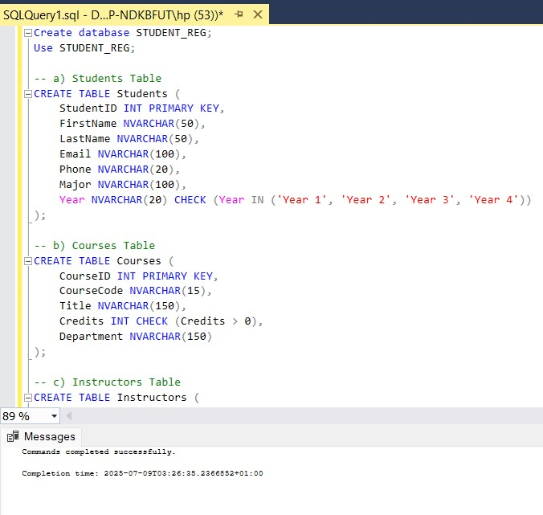

**Note**: PRIMARY KEY: This ensures that each StudentID is unique and not null.  
NVARCHAR(50): means it can store up to 50 Unicode characters, supporting different languages and characters (e.g., accented letters).
FOREIGN KEY: A FOREIGN KEY is a constraint in SQL that creates a relationship between two tables. It ensures referential integrity

#### 3. View table

```sql
Select * from Students;
Select * from Courses;
Select * from CourseOfferings;
Select * from Instructors;
Select * from Enrollments;
Select * from Prerequisites;
```
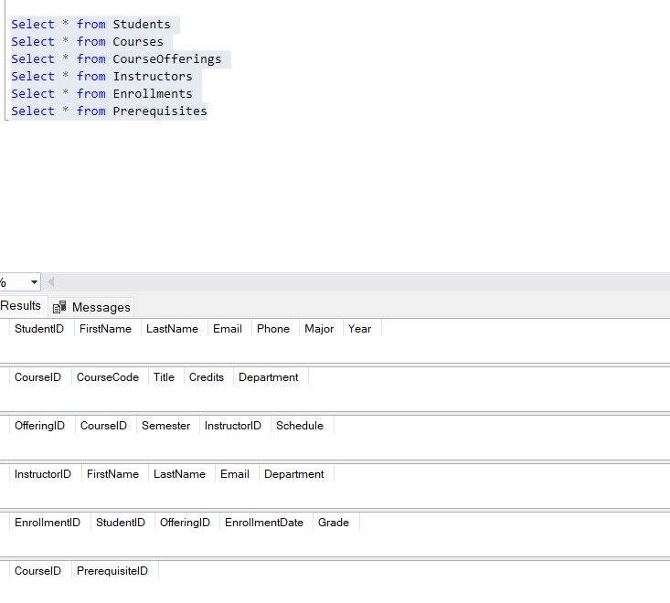

#### 4. Insert data to table

```sql

---Student----

BULK INSERT Students
FROM "C:\Users\hp\Downloads\Students (1).csv"
WITH (
    FIRSTROW = 2,
    FIELDTERMINATOR = ',',
    ROWTERMINATOR = '0x0a', -- Unix-style line endings
    TABLOCK,
    KEEPNULLS,
    CODEPAGE = '65001' -- Handles UTF-8
);

----Course------

BULK INSERT Courses
FROM "C:\Users\hp\Downloads\Courses (1).csv"
WITH (
    FIRSTROW = 2,
    FIELDTERMINATOR = ',',
    ROWTERMINATOR = '0x0a', -- Unix-style line endings
    TABLOCK,
    KEEPNULLS,
    CODEPAGE = '65001' -- Handles UTF-8
);

-----Instructor---

BULK INSERT Instructors
FROM "C:\Users\hp\Downloads\Instructors (1).csv"
WITH (
    FIRSTROW = 2,
    FIELDTERMINATOR = ',',
    ROWTERMINATOR = '0x0a', -- Unix-style line endings
    TABLOCK,
    KEEPNULLS,
    CODEPAGE = '65001' -- Handles UTF-8
);

------CourseOfferings----

BULK INSERT CourseOfferings
FROM "C:\Users\hp\Downloads\CourseOfferings (1).csv"
WITH (
    FIRSTROW = 2,
    FIELDTERMINATOR = ',',
    ROWTERMINATOR = '0x0a', -- Unix-style line endings
    TABLOCK,
    KEEPNULLS,
    CODEPAGE = '65001' -- Handles UTF-8
);

-----Enrollments----

BULK INSERT Enrollments
FROM "C:\Users\hp\Downloads\Enrollments (1).csv"
WITH (
    FIRSTROW = 2,
    FIELDTERMINATOR = ',',
    ROWTERMINATOR = '0x0a', -- Unix-style line endings
    TABLOCK,
    KEEPNULLS,
    CODEPAGE = '65001' -- Handles UTF-8
);

----Prerequisites------

BULK INSERT Prerequisites
FROM "C:\Users\hp\Downloads\Prerequisites (1).csv"
WITH (
    FIRSTROW = 2,
    FIELDTERMINATOR = ',',
    ROWTERMINATOR = '0x0a', -- Unix-style line endings
    TABLOCK,
    KEEPNULLS,
    CODEPAGE = '65001' -- Handles UTF-8
);

```

**BULK INSERT Students**: This command instructs SQL Server to import data from an external file into the Students table.

**FROM "C:\Users\hp\Downloads\Students (1).csv"**: Specifies the path to the CSV file importing from the computer

**FIRSTROW = 2** : Tells SQL Server to start reading from the second row. The first row is typically a header row (column names), which you needs to skip.

**FIELDTERMINATOR = ','**: Specifies that columns are separated by commas (CSV = Comma Separated Values).

**ROWTERMINATOR = '0x0a'**: This defines how each row ends. 0x0a is the Unix-style line break (Line Feed \n).

**TABLOCK**: Improves performance by locking the table during the insert operation. Recommended for large imports.

**KEEPNULLS**: If a field in the file is empty, it inserts SQL NULL instead of default values.

**CODEPAGE = '65001'**: Specifies that the file is in UTF-8 encoding. This is necessary if the CSV contains non-English characters, emojis, or accented letters.

#### 5. Verify data insertion

```sql
SELECT TOP 3 * FROM Students;
SELECT TOP 3 * FROM Courses;
SELECT TOP 3 * FROM CourseOfferings;
SELECT TOP 3 * FROM Instructors;
SELECT TOP 3 * FROM Enrollments;
SELECT TOP 3 * FROM Prerequisites;
```
**This code shows the first three line in each table**

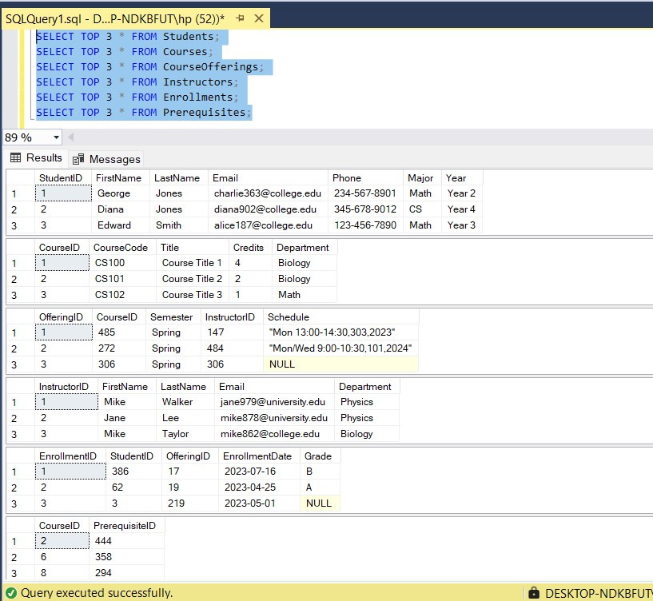

### 4. Simulate Real-World Data Challenges

#### 1. Data consistency enforcement

##### a. Total numbers of data in each table
  
```sql
Select count(*) As Total_student_table_no from Students;
Select count(*) As Total_Courses_table_no from Courses;
Select count(*) As Total_Instructors_table_no from Instructors;
Select count(*) As Total_CourseOfferings_table_no from CourseOfferings;
Select count(*) As Total_Prerequisitese_no from Prerequisites;
```
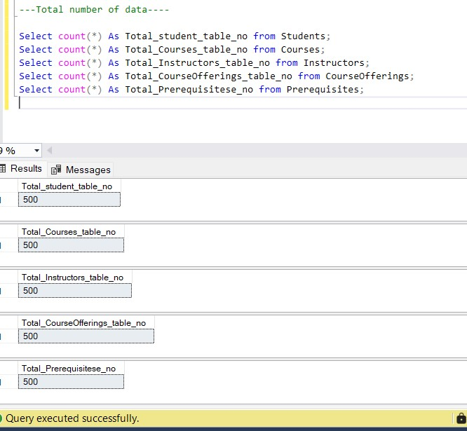

#### 2. Empty fields and NULL values

##### a. Numbers of column in each table

```sql
-- Students Table
SELECT 
    COUNT(*) AS Total_Students_Columns,
    STRING_AGG(COLUMN_NAME, ', ') AS Student_Columns
FROM INFORMATION_SCHEMA.COLUMNS
WHERE TABLE_NAME = 'Students';

-- Courses Table
SELECT 
    COUNT(*) AS Total_Courses_Columns,
    STRING_AGG(COLUMN_NAME, ', ') AS Course_Columns
FROM INFORMATION_SCHEMA.COLUMNS
WHERE TABLE_NAME = 'Courses';

-- Instructors Table
SELECT 
    COUNT(*) AS Total_Instructors_Columns,
    STRING_AGG(COLUMN_NAME, ', ') AS Instructor_Columns
FROM INFORMATION_SCHEMA.COLUMNS
WHERE TABLE_NAME = 'Instructors';

-- CourseOfferings Table
SELECT 
    COUNT(*) AS Total_CourseOfferings_Columns,
    STRING_AGG(COLUMN_NAME, ', ') AS CourseOfferings_Columns
FROM INFORMATION_SCHEMA.COLUMNS
WHERE TABLE_NAME = 'CourseOfferings';

-- Prerequisites Table
SELECT 
    COUNT(*) AS Total_Prerequisites_Columns,
    STRING_AGG(COLUMN_NAME, ', ') AS Prerequisites_Columns
FROM INFORMATION_SCHEMA.COLUMNS
WHERE TABLE_NAME = 'Prerequisites';
```
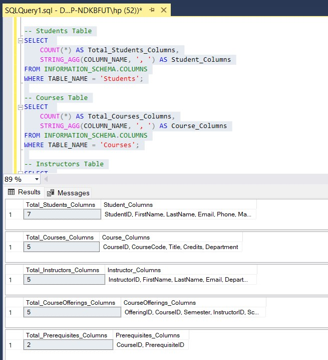

##### b. Duplicate entries

No duplicate in the data after running this code.

```sql
SELECT 
    FirstName, LastName, Email, Phone, Major, Year,
    COUNT(*) AS Occurrences
FROM Students
GROUP BY FirstName, LastName, Email, Phone, Major, Year
HAVING COUNT(*) > 1;

-- Total number of duplicate rows
SELECT 
    SUM(Occurrences) - COUNT(*) AS Total_Duplicates
FROM (
    SELECT COUNT(*) AS Occurrences
    FROM Students
    GROUP BY FirstName, LastName, Email, Phone, Major, Year
    HAVING COUNT(*) > 1
) AS Dup;

---Courses Table – Duplicate Rows---

SELECT 
    CourseCode, Title, Credits, Department,
    COUNT(*) AS Occurrences
FROM Courses
GROUP BY CourseCode, Title, Credits, Department
HAVING COUNT(*) > 1;

SELECT 
    SUM(Occurrences) - COUNT(*) AS Total_Duplicates
FROM (
    SELECT COUNT(*) AS Occurrences
    FROM Courses
    GROUP BY CourseCode, Title, Credits, Department
    HAVING COUNT(*) > 1
) AS Dup;

---Instructors Table – Duplicate Rows---

SELECT 
    FirstName, LastName, Email, Department,
    COUNT(*) AS Occurrences
FROM Instructors
GROUP BY FirstName, LastName, Email, Department
HAVING COUNT(*) > 1;

SELECT 
    SUM(Occurrences) - COUNT(*) AS Total_Duplicates
FROM (
    SELECT COUNT(*) AS Occurrences
    FROM Instructors
    GROUP BY FirstName, LastName, Email, Department
    HAVING COUNT(*) > 1
) AS Dup;


---CourseOfferings Table – Duplicate Rows---

SELECT 
    CourseID, Semester, InstructorID, Schedule,
    COUNT(*) AS Occurrences
FROM CourseOfferings
GROUP BY CourseID, Semester, InstructorID, Schedule
HAVING COUNT(*) > 1;

SELECT 
    SUM(Occurrences) - COUNT(*) AS Total_Duplicates
FROM (
    SELECT COUNT(*) AS Occurrences
    FROM CourseOfferings
    GROUP BY CourseID, Semester, InstructorID, Schedule
    HAVING COUNT(*) > 1
) AS Dup;

---Prerequisites Table – Duplicate Rows---

SELECT 
    CourseID, PrerequisiteID,
    COUNT(*) AS Occurrences
FROM Prerequisites
GROUP BY CourseID, PrerequisiteID
HAVING COUNT(*) > 1;

SELECT 
    SUM(Occurrences) - COUNT(*) AS Total_Duplicates
FROM (
    SELECT COUNT(*) AS Occurrences
    FROM Prerequisites
    GROUP BY CourseID, PrerequisiteID
    HAVING COUNT(*) > 1
) AS Dup;
```
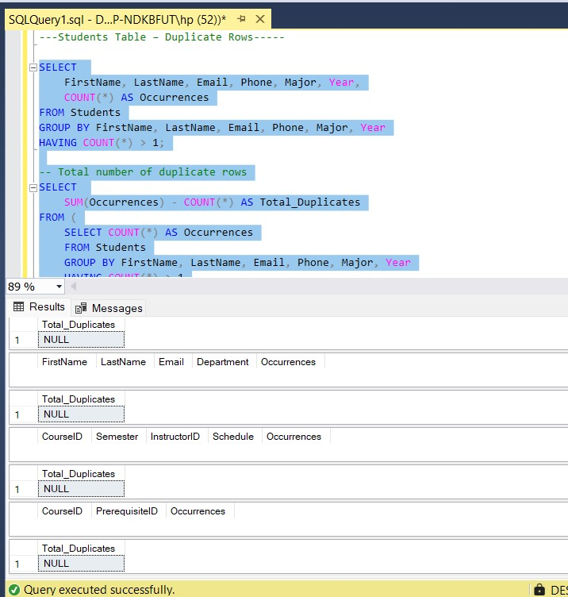

##### c. Total number of null values and empty cells

```sql
SELECT
    COUNT(*) AS TotalRows,
    
    SUM(CASE WHEN FirstName IS NULL THEN 1 ELSE 0 END) AS Null_FirstName,
    SUM(CASE WHEN FirstName = '' THEN 1 ELSE 0 END) AS Empty_FirstName,

    SUM(CASE WHEN LastName IS NULL THEN 1 ELSE 0 END) AS Null_LastName,
    SUM(CASE WHEN LastName = '' THEN 1 ELSE 0 END) AS Empty_LastName,

    SUM(CASE WHEN Email IS NULL THEN 1 ELSE 0 END) AS Null_Email,
    SUM(CASE WHEN Email = '' THEN 1 ELSE 0 END) AS Empty_Email,

    SUM(CASE WHEN Phone IS NULL THEN 1 ELSE 0 END) AS Null_Phone,
    SUM(CASE WHEN Phone = '' THEN 1 ELSE 0 END) AS Empty_Phone,

    SUM(CASE WHEN Major IS NULL THEN 1 ELSE 0 END) AS Null_Major,
    SUM(CASE WHEN Major = '' THEN 1 ELSE 0 END) AS Empty_Major,

    SUM(CASE WHEN Year IS NULL THEN 1 ELSE 0 END) AS Null_Year,
    SUM(CASE WHEN Year = '' THEN 1 ELSE 0 END) AS Empty_Year

FROM Students;

SELECT
    COUNT(*) AS TotalRows,

    -- CourseCode column (text)
    SUM(CASE WHEN CourseCode IS NULL THEN 1 ELSE 0 END) AS Null_CourseCode,
    SUM(CASE WHEN CourseCode = '' THEN 1 ELSE 0 END) AS Empty_CourseCode,

    -- Title column (text)
    SUM(CASE WHEN Title IS NULL THEN 1 ELSE 0 END) AS Null_Title,
    SUM(CASE WHEN Title = '' THEN 1 ELSE 0 END) AS Empty_Title,

    -- Credits column (numeric)
    SUM(CASE WHEN Credits IS NULL THEN 1 ELSE 0 END) AS Null_Credits,

    -- Department column (text)
    SUM(CASE WHEN Department IS NULL THEN 1 ELSE 0 END) AS Null_Department,
    SUM(CASE WHEN Department = '' THEN 1 ELSE 0 END) AS Empty_Department

FROM Courses;

SELECT
    COUNT(*) AS TotalRows,

    SUM(CASE WHEN FirstName IS NULL THEN 1 ELSE 0 END) AS Null_FirstName,
    SUM(CASE WHEN FirstName = '' THEN 1 ELSE 0 END) AS Empty_FirstName,

    SUM(CASE WHEN LastName IS NULL THEN 1 ELSE 0 END) AS Null_LastName,
    SUM(CASE WHEN LastName = '' THEN 1 ELSE 0 END) AS Empty_LastName,

    SUM(CASE WHEN Email IS NULL THEN 1 ELSE 0 END) AS Null_Email,
    SUM(CASE WHEN Email = '' THEN 1 ELSE 0 END) AS Empty_Email,

    SUM(CASE WHEN Department IS NULL THEN 1 ELSE 0 END) AS Null_Department,
    SUM(CASE WHEN Department = '' THEN 1 ELSE 0 END) AS Empty_Department

FROM Instructors;


SELECT
    COUNT(*) AS TotalRows,

    SUM(CASE WHEN CourseID IS NULL THEN 1 ELSE 0 END) AS Null_CourseID,

    SUM(CASE WHEN Semester IS NULL THEN 1 ELSE 0 END) AS Null_Semester,
    SUM(CASE WHEN Semester = '' THEN 1 ELSE 0 END) AS Empty_Semester,

    SUM(CASE WHEN InstructorID IS NULL THEN 1 ELSE 0 END) AS Null_InstructorID,

    SUM(CASE WHEN Schedule IS NULL THEN 1 ELSE 0 END) AS Null_Schedule,
    SUM(CASE WHEN Schedule = '' THEN 1 ELSE 0 END) AS Empty_Schedule

FROM CourseOfferings;

SELECT
    COUNT(*) AS TotalRows,

    SUM(CASE WHEN StudentID IS NULL THEN 1 ELSE 0 END) AS Null_StudentID,
    SUM(CASE WHEN OfferingID IS NULL THEN 1 ELSE 0 END) AS Null_OfferingID,
    SUM(CASE WHEN EnrollmentDate IS NULL THEN 1 ELSE 0 END) AS Null_EnrollmentDate,

    SUM(CASE WHEN Grade IS NULL THEN 1 ELSE 0 END) AS Null_Grade,
    SUM(CASE WHEN Grade = '' THEN 1 ELSE 0 END) AS Empty_Grade

FROM Enrollments;

SELECT
    COUNT(*) AS TotalRows,

    SUM(CASE WHEN CourseID IS NULL THEN 1 ELSE 0 END) AS Null_CourseID,
    SUM(CASE WHEN PrerequisiteID IS NULL THEN 1 ELSE 0 END) AS Null_PrerequisiteID

FROM Prerequisites;
```
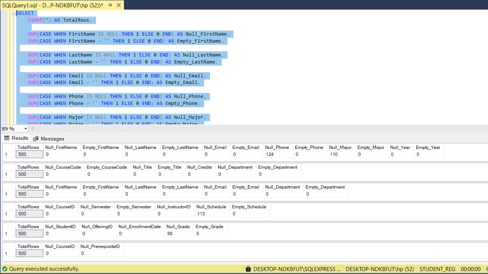

| **Table**         | **Column**    | **NULL Count** | **Remarks**                         |
| ----------------- | ------------- | -------------- | ----------------------------------- |
| `Students`        | `Phone`       | 124            | Missing contact information         |
| `Students`        | `Major`       | 110            | Students with unspecified major     |
| `Courses`         | *All Columns* | 0              | No NULL values detected             |
| `Instructors`     | *All Columns* | 0              | No NULL values detected             |
| `CourseOfferings` | `Schedule`    | 113            | Courses without assigned schedule   |
| `Enrollments`     | `Grade`       | 88             | Students with no recorded grade yet |
| `Prerequisites`   | *All Columns* | 0              | No NULL values detected             |


### 5. Inconsistent or edge-case values (e.g., invalid grades, blank emails)

#### Data cleaning
Data cleaning means fixing or removing incorrect, messy, or missing data.

##### a. Data Cleaning Description

In the CourseOfferings table, there are 113 missing values in the Schedule column. These missing entries are filled based on the Semester:

If the semester is Fall, replace the missing schedule with:
➤ "Tue/Thu 11:00-12:30,202,2025"

If the semester is Summer, replace it with:
➤ "Mon 13:00-14:30,303,2023"

If the semester is Spring, replace it with:
➤ "Mon 13:00-14:30,303,2023"

In the Enrollments table, there are 88 missing values in the Grade column. All missing grades are replaced with:
➤ "B"

In the Students table:

110 rows have missing values in the Major column. These are filled with either:
➤ "Physics" or "Math" (assigned randomly)

124 rows have missing values in the Phone column. These are replaced with:
➤ "000-000-0000"

| Table           | Column   | Null Count | Replacement Value                           |
| --------------- | -------- | ---------- | ------------------------------------------- |
| CourseOfferings | Schedule | 113        | Depends on `Semester`:                      |
|                 |          |            | • Fall → `"Tue/Thu 11:00-12:30,202,2025"`   |
|                 |          |            | • Summer → `"Mon 13:00-14:30,303,2023"`     |
|                 |          |            | • Spring → `"Mon 13:00-14:30,303,2023"`     |
| Enrollments     | Grade    | 88         | `"B"`                                       |
| Students        | Major    | 110        | `"Physics"` or `"Math"` (randomly assigned) |
| Students        | Phone    | 124        | `"000-000-0000"`                            |


##### b. Data cleaning steps

- Update NULL Schedule values in CourseOfferings

```sql
Fall semester
UPDATE CourseOfferings
SET Schedule = 'Tue/Thu 11:00-12:30,202,2025'
WHERE Schedule IS NULL AND Semester = 'Fall';

Summer semester
UPDATE CourseOfferings
SET Schedule = 'Mon 13:00-14:30,303,2023'
WHERE Schedule IS NULL AND Semester = 'Summer';

Spring semester
UPDATE CourseOfferings
SET Schedule = 'Mon 13:00-14:30,303,2023'
WHERE Schedule IS NULL AND Semester = 'Spring';
```

- Update NULL Grade values in Enrollments
  
```sql
UPDATE Enrollments
SET Grade = 'B'
WHERE Grade IS NULL;
```

- Update NULL Major values in Students

**Note**: Since there is no logic to differentiate between assigning "Physics" or "Math", we'll randomly assign one of them using a SQL trick (if you want all to be "Physics" or "Math")

```sql
UPDATE Students
SET Major = 
    CASE 
        WHEN ABS(CHECKSUM(NEWID())) % 2 = 0 THEN 'Physics'
        ELSE 'Math'
    END
WHERE Major IS NULL;
```

- Update NULL Phone values in Students

```sql
UPDATE Students
SET Phone = '000-000-0000'
WHERE Phone IS NULL;
```

- Data cleaning complete Check.

  ```sql
SELECT
    COUNT(*) AS TotalRows,
    
    SUM(CASE WHEN FirstName IS NULL THEN 1 ELSE 0 END) AS Null_FirstName,
    SUM(CASE WHEN FirstName = '' THEN 1 ELSE 0 END) AS Empty_FirstName,

    SUM(CASE WHEN LastName IS NULL THEN 1 ELSE 0 END) AS Null_LastName,
    SUM(CASE WHEN LastName = '' THEN 1 ELSE 0 END) AS Empty_LastName,

    SUM(CASE WHEN Email IS NULL THEN 1 ELSE 0 END) AS Null_Email,
    SUM(CASE WHEN Email = '' THEN 1 ELSE 0 END) AS Empty_Email,

    SUM(CASE WHEN Phone IS NULL THEN 1 ELSE 0 END) AS Null_Phone,
    SUM(CASE WHEN Phone = '' THEN 1 ELSE 0 END) AS Empty_Phone,

    SUM(CASE WHEN Major IS NULL THEN 1 ELSE 0 END) AS Null_Major,
    SUM(CASE WHEN Major = '' THEN 1 ELSE 0 END) AS Empty_Major,

    SUM(CASE WHEN Year IS NULL THEN 1 ELSE 0 END) AS Null_Year,
    SUM(CASE WHEN Year = '' THEN 1 ELSE 0 END) AS Empty_Year

FROM Students;

SELECT
    COUNT(*) AS TotalRows,

    -- CourseCode column (text)
    SUM(CASE WHEN CourseCode IS NULL THEN 1 ELSE 0 END) AS Null_CourseCode,
    SUM(CASE WHEN CourseCode = '' THEN 1 ELSE 0 END) AS Empty_CourseCode,

    -- Title column (text)
    SUM(CASE WHEN Title IS NULL THEN 1 ELSE 0 END) AS Null_Title,
    SUM(CASE WHEN Title = '' THEN 1 ELSE 0 END) AS Empty_Title,

    -- Credits column (numeric)
    SUM(CASE WHEN Credits IS NULL THEN 1 ELSE 0 END) AS Null_Credits,

    -- Department column (text)
    SUM(CASE WHEN Department IS NULL THEN 1 ELSE 0 END) AS Null_Department,
    SUM(CASE WHEN Department = '' THEN 1 ELSE 0 END) AS Empty_Department

FROM Courses;

SELECT
    COUNT(*) AS TotalRows,

    SUM(CASE WHEN FirstName IS NULL THEN 1 ELSE 0 END) AS Null_FirstName,
    SUM(CASE WHEN FirstName = '' THEN 1 ELSE 0 END) AS Empty_FirstName,

    SUM(CASE WHEN LastName IS NULL THEN 1 ELSE 0 END) AS Null_LastName,
    SUM(CASE WHEN LastName = '' THEN 1 ELSE 0 END) AS Empty_LastName,

    SUM(CASE WHEN Email IS NULL THEN 1 ELSE 0 END) AS Null_Email,
    SUM(CASE WHEN Email = '' THEN 1 ELSE 0 END) AS Empty_Email,

    SUM(CASE WHEN Department IS NULL THEN 1 ELSE 0 END) AS Null_Department,
    SUM(CASE WHEN Department = '' THEN 1 ELSE 0 END) AS Empty_Department

FROM Instructors;


SELECT
    COUNT(*) AS TotalRows,

    SUM(CASE WHEN CourseID IS NULL THEN 1 ELSE 0 END) AS Null_CourseID,

    SUM(CASE WHEN Semester IS NULL THEN 1 ELSE 0 END) AS Null_Semester,
    SUM(CASE WHEN Semester = '' THEN 1 ELSE 0 END) AS Empty_Semester,

    SUM(CASE WHEN InstructorID IS NULL THEN 1 ELSE 0 END) AS Null_InstructorID,

    SUM(CASE WHEN Schedule IS NULL THEN 1 ELSE 0 END) AS Null_Schedule,
    SUM(CASE WHEN Schedule = '' THEN 1 ELSE 0 END) AS Empty_Schedule

FROM CourseOfferings;

SELECT
    COUNT(*) AS TotalRows,

    SUM(CASE WHEN StudentID IS NULL THEN 1 ELSE 0 END) AS Null_StudentID,
    SUM(CASE WHEN OfferingID IS NULL THEN 1 ELSE 0 END) AS Null_OfferingID,
    SUM(CASE WHEN EnrollmentDate IS NULL THEN 1 ELSE 0 END) AS Null_EnrollmentDate,

    SUM(CASE WHEN Grade IS NULL THEN 1 ELSE 0 END) AS Null_Grade,
    SUM(CASE WHEN Grade = '' THEN 1 ELSE 0 END) AS Empty_Grade

FROM Enrollments;

SELECT
    COUNT(*) AS TotalRows,

    SUM(CASE WHEN CourseID IS NULL THEN 1 ELSE 0 END) AS Null_CourseID,
    SUM(CASE WHEN PrerequisiteID IS NULL THEN 1 ELSE 0 END) AS Null_PrerequisiteID

FROM Prerequisites;
```
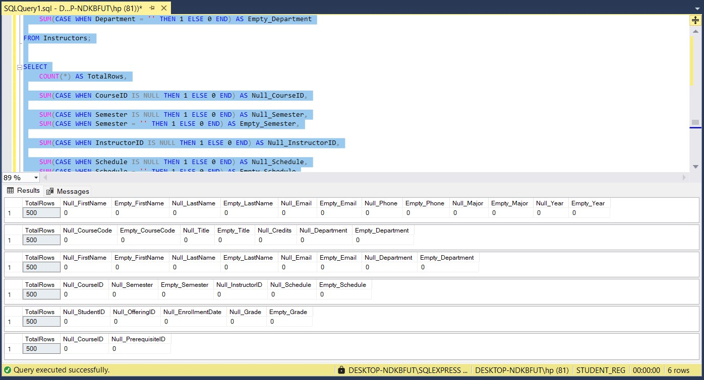


### 6. Querying, Data Integrity, and Business Logic

#### A) Student Services Queries

- **Question 1**: Retrieve all courses a student is enrolled in for a given semester.

```sql
SELECT 
    CO.Semester,
    S.FirstName, 
    S.LastName, 
    S.Major, 
    C.CourseCode, 
    C.Title, 
    C.CourseID, 
    C.Department
FROM 
    Students S
INNER JOIN Enrollments E ON S.StudentID = E.StudentID
INNER JOIN CourseOfferings CO ON E.OfferingID = CO.OfferingID
INNER JOIN Courses C ON CO.CourseID = C.CourseID
WHERE 
    CO.Semester LIKE 'Fall%' 
    OR CO.Semester LIKE 'Winter%' 
    OR CO.Semester LIKE 'Spring%' 
    OR CO.Semester LIKE 'Summer%'
ORDER BY 
    CO.Semester, 
    S.LastName, 
    S.FirstName;
```
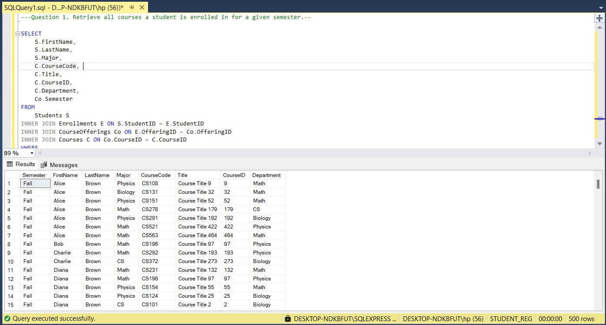

- **Question 2**: Display a student's transcript (course titles, semesters, grades, GPA).

```sql
SELECT 
    S.StudentID,
    S.FirstName,
    S.LastName,
    C.Title AS CourseTitle,
    CO.Semester,
    E.Grade,
    C.Credits,
    
    -- Grade Points based on letter grade multiplied by course credits
    (
        CASE E.Grade
            WHEN 'A'  THEN 4.0
            WHEN 'A-' THEN 3.7
            WHEN 'B+' THEN 3.3
            WHEN 'B'  THEN 3.0
            WHEN 'B-' THEN 2.7
            WHEN 'C+' THEN 2.3
            WHEN 'C'  THEN 2.0
            WHEN 'C-' THEN 1.7
            WHEN 'D'  THEN 1.0
            WHEN 'F'  THEN 0.0
            ELSE NULL
        END
    ) * C.Credits AS GradePoints,

    -- GPA per Semester using windowed aggregate functions
    ROUND(
        SUM(
            (
                CASE E.Grade
                    WHEN 'A'  THEN 4.0
                    WHEN 'A-' THEN 3.7
                    WHEN 'B+' THEN 3.3
                    WHEN 'B'  THEN 3.0
                    WHEN 'B-' THEN 2.7
                    WHEN 'C+' THEN 2.3
                    WHEN 'C'  THEN 2.0
                    WHEN 'C-' THEN 1.7
                    WHEN 'D'  THEN 1.0
                    WHEN 'F'  THEN 0.0
                    ELSE NULL
                END
            ) * C.Credits
        ) OVER (PARTITION BY CO.Semester) 
        / 
        SUM(C.Credits) OVER (PARTITION BY CO.Semester), 
        2
    ) AS GPA_Per_Semester

FROM 
    Students S
INNER JOIN Enrollments E ON S.StudentID = E.StudentID
INNER JOIN CourseOfferings CO ON E.OfferingID = CO.OfferingID
INNER JOIN Courses C ON CO.CourseID = C.CourseID

WHERE 
    S.StudentID = 15 -- Change as needed for any student transcript

ORDER BY 
    CO.Semester;
```

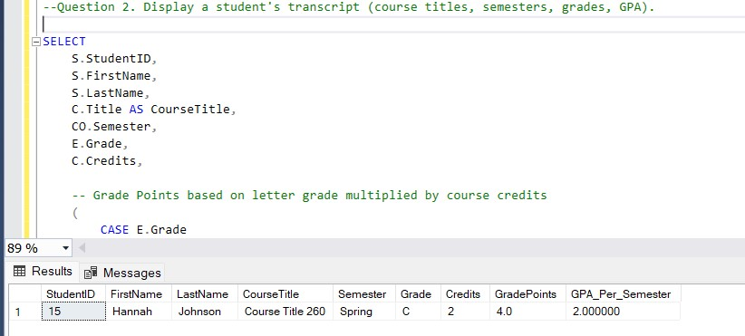

- **Question 3**: Find students who haven't completed prerequisites for a course.

```sql
SELECT DISTINCT
    S.StudentID,
    S.FirstName,
    S.LastName,
    CO.CourseID,
    C.Title AS CourseTitle
FROM
    Students S
JOIN Enrollments E ON S.StudentID = E.StudentID
JOIN CourseOfferings CO ON E.OfferingID = CO.OfferingID
JOIN Courses C ON CO.CourseID = C.CourseID
JOIN Prerequisites P ON P.CourseID = CO.CourseID
WHERE
    NOT EXISTS (
        SELECT 1
        FROM Enrollments E2
        JOIN CourseOfferings CO2 ON E2.OfferingID = CO2.OfferingID
        WHERE E2.StudentID = S.StudentID
          AND CO2.CourseID = P.PrerequisiteID
          AND E2.Grade IN ('A','A-','B+','B','B-','C+','C','C-','D')  -- Passing grades
    )
ORDER BY
    S.StudentID, CO.CourseID;
```

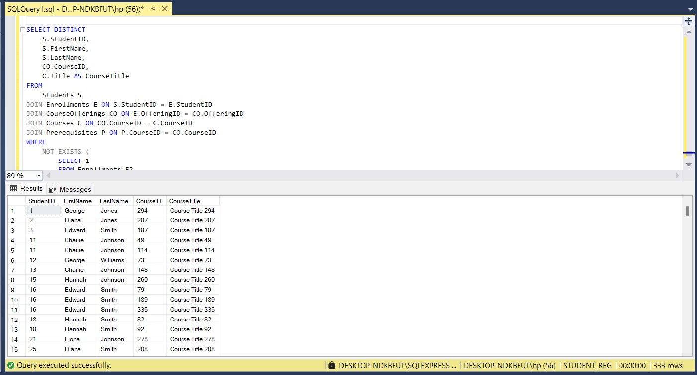


#### B) Administrative Queries

- **Question 4**: List all courses offered in a department in a given semester.

```sql
SELECT
    C.CourseID,
    C.Title AS CourseTitle,
    C.Department,
    CO.OfferingID,
    CO.Semester
FROM 
    Courses C 
INNER JOIN CourseOfferings CO  
    ON C.CourseID = CO.CourseID
ORDER BY
    CO.Semester,
    C.Department,
    C.CourseID;

--list courses base on condition (department and semester)

SELECT
    C.CourseID,
    C.Title AS CourseTitle,
    C.Department,
    CO.OfferingID,
    CO.Semester
FROM 
    Courses C 
INNER JOIN CourseOfferings CO  
    ON C.CourseID = CO.CourseID
WHERE
    C.Department = 'Biology' -- Replace with desired department
    AND CO.Semester = 'Spring'     -- Replace with desired semester
ORDER BY
    CO.Semester,
    C.Department,
    C.CourseID;
```

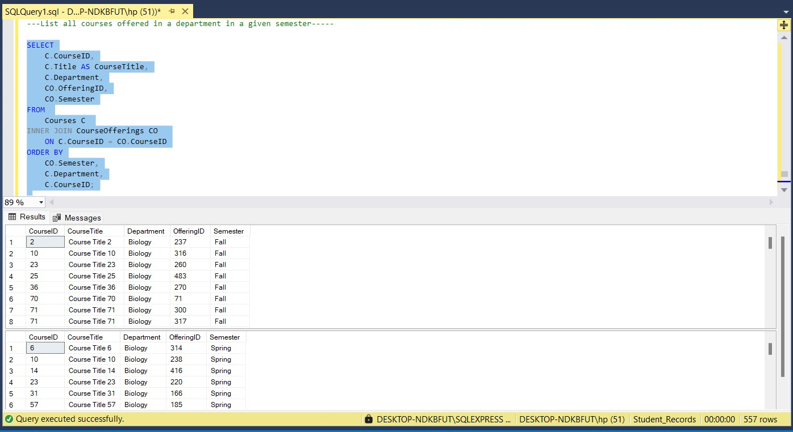

- **Question 5**: Generate instructor-wise course loads per semester.
  
```sql
SELECT
    I.InstructorID,
    I.FirstName,
    I.LastName,
    CO.Semester,
    COUNT(CO.OfferingID) AS CoursesTaught
FROM
    Instructors I
JOIN CourseOfferings CO ON I.InstructorID = CO.InstructorID
GROUP BY
    I.InstructorID,
    I.FirstName,
    I.LastName,
    CO.Semester
ORDER BY
    CO.Semester,
    I.LastName,
    I.FirstName;
```
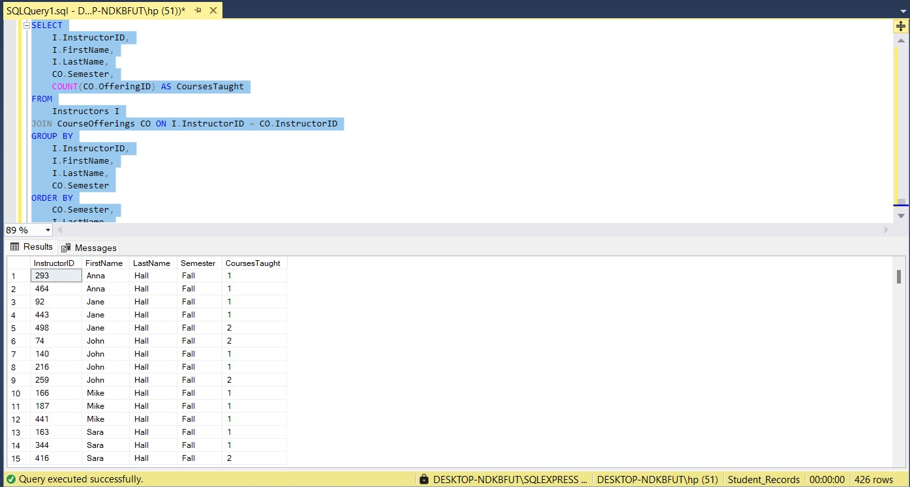

- **Question 6**: Find under-enrolled offerings (less than 5 students).

```sql
SELECT
    S.FirstName,
    S.LastName,
    E.OfferingID,
    E.EnrollmentID
FROM
    Enrollments E
JOIN
    Students S ON E.StudentID = S.StudentID
WHERE
    E.OfferingID IN (
        SELECT OfferingID
        FROM Enrollments
        GROUP BY OfferingID
        HAVING COUNT(StudentID) < 5
    )
ORDER BY
    E.OfferingID, S.LastName, S.FirstName;
```

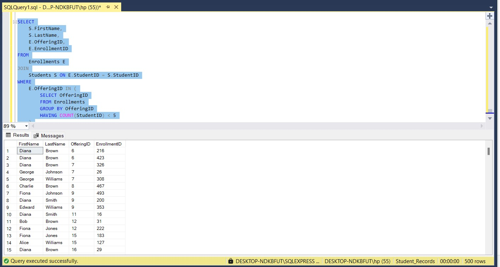


#### C) Update and Maintain Data

- **Question 7**: Update a student’s major.

```sql
UPDATE Students
SET Major = 'Biochemistry'
WHERE StudentID = 1;
```
<style>
.image-container {
    display: flex;
    gap: 20px;
    justify-content: center;
    align-items: center;
    flex-wrap: wrap;
}

.image-container img {
    width: 300px;
    height: auto;
    border-radius: 8px;
    box-shadow: 0 4px 12px rgba(0,0,0,0.2);
    transition: transform 0.3s ease, box-shadow 0.3s ease;
    cursor: zoom-in;
}

.image-container img:hover {
    transform: scale(1.2);
    z-index: 10;
    box-shadow: 0 8px 24px rgba(0,0,0,0.4);
}
</style>

<div class="image-container">
  
  
</div>

- **Question 8**: Assign grades to students post-semester.

```sql
UPDATE Enrollments
SET Grade = 'A'
WHERE StudentID = 163
  AND OfferingID = 196;
```

<style>
.image-container {
    display: flex;
    gap: 20px;
    justify-content: center;
    align-items: center;
    flex-wrap: wrap;
}

.image-container img {
    width: 300px;
    height: auto;
    border-radius: 8px;
    box-shadow: 0 4px 12px rgba(0,0,0,0.2);
    transition: transform 0.3s ease, box-shadow 0.3s ease;
    cursor: zoom-in;
}

.image-container img:hover {
    transform: scale(1.2);
    z-index: 10;
    box-shadow: 0 8px 24px rgba(0,0,0,0.4);
}
</style>

<div class="image-container">
  
  
</div>

- **Question 9**: Drop a student from a course.
  
```sql
DELETE FROM Enrollments
WHERE StudentID = 386 AND OfferingID = 105;
```

<style>
.image-container {
    display: flex;
    gap: 20px;
    justify-content: center;
    align-items: center;
    flex-wrap: wrap;
}

.image-container img {
    width: 300px;
    height: auto;
    border-radius: 8px;
    box-shadow: 0 4px 12px rgba(0,0,0,0.2);
    transition: transform 0.3s ease, box-shadow 0.3s ease;
    cursor: zoom-in;
}

.image-container img:hover {
    transform: scale(1.2);
    z-index: 10;
    box-shadow: 0 8px 24px rgba(0,0,0,0.4);
}
</style>

<div class="image-container">
  
  
</div>

### 7. Optional: Create SQL Views for Abstraction

- **Question 10**: StudentTranscriptView (Combines student, course, and grade info with GPA)

```sql
CREATE VIEW Student_Transcript_View AS
SELECT
    S.StudentID,
    S.FirstName,
    S.LastName,
    C.CourseID,
    C.Title AS CourseTitle,
    E.OfferingID,
    E.Grade,
    -- Example GPA calculation assuming letter grades converted to points
    CASE E.Grade
        WHEN 'A'  THEN 4.0
        WHEN 'A-' THEN 3.7
        WHEN 'B+' THEN 3.3
        WHEN 'B'  THEN 3.0
        WHEN 'B-' THEN 2.7
        WHEN 'C+' THEN 2.3
        WHEN 'C'  THEN 2.0
        WHEN 'C-' THEN 1.7
        WHEN 'D'  THEN 1.0
        WHEN 'F'  THEN 0.0
        ELSE NULL
    END AS GradePoints
FROM Students S
JOIN Enrollments E ON S.StudentID = E.StudentID
JOIN CourseOfferings CO ON E.OfferingID = CO.OfferingID
JOIN Courses C ON CO.CourseID = C.CourseID;
```

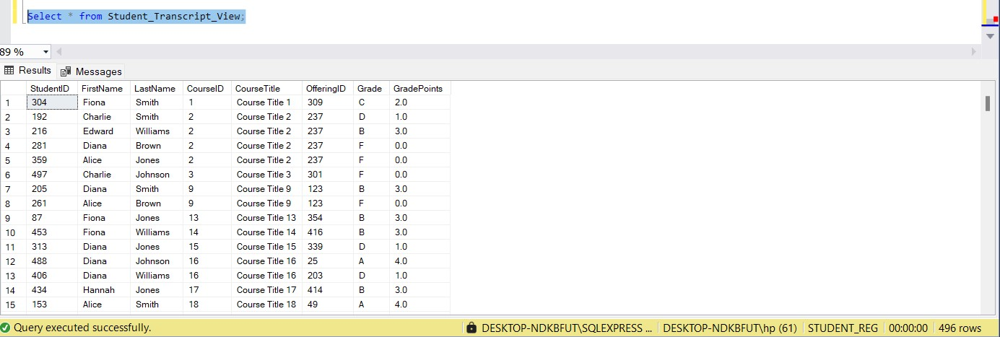

- **Question 11**: InstructorScheduleView (Lists courses and schedule for each instructor)

```sql
CREATE VIEW Instructor_Schedule_View AS
SELECT
    I.InstructorID,
    I.FirstName,
    I.LastName,
    C.CourseID,
    C.Title AS CourseTitle,
    CO.OfferingID,
    CO.Semester,

    -- Extract and clean Year (3rd comma-separated value)
    CAST(
        REPLACE(
            LTRIM(RTRIM(
                SUBSTRING(
                    CO.Schedule,
                    CHARINDEX(',', CO.Schedule, CHARINDEX(',', CO.Schedule) + 1) + 1,
                    LEN(CO.Schedule)
                )
            )), '"', ''
        ) AS INT
    ) AS Year,

    -- Extract and clean Room (2nd comma-separated value)
    CAST(
        REPLACE(
            LTRIM(RTRIM(
                SUBSTRING(
                    CO.Schedule,
                    CHARINDEX(',', CO.Schedule) + 1,
                    CHARINDEX(',', CO.Schedule, CHARINDEX(',', CO.Schedule) + 1) - CHARINDEX(',', CO.Schedule) - 1
                )
            )), '"', ''
        ) AS INT
    ) AS Room,

    -- Extract Days (before first space)
    SUBSTRING(
        CO.Schedule,
        1,
        CHARINDEX(' ', CO.Schedule) - 1
    ) AS Days,

    -- Extract StartTime (after first space, before '-')
    SUBSTRING(
        CO.Schedule,
        CHARINDEX(' ', CO.Schedule) + 1,
        CHARINDEX('-', CO.Schedule) - CHARINDEX(' ', CO.Schedule) - 1
    ) AS StartTime,

    -- Extract EndTime (between '-' and first comma)
    SUBSTRING(
        CO.Schedule,
        CHARINDEX('-', CO.Schedule) + 1,
        CHARINDEX(',', CO.Schedule) - CHARINDEX('-', CO.Schedule) - 1
    ) AS EndTime

FROM Instructors I
JOIN CourseOfferings CO ON I.InstructorID = CO.InstructorID
JOIN Courses C ON CO.CourseID = C.CourseID;
```
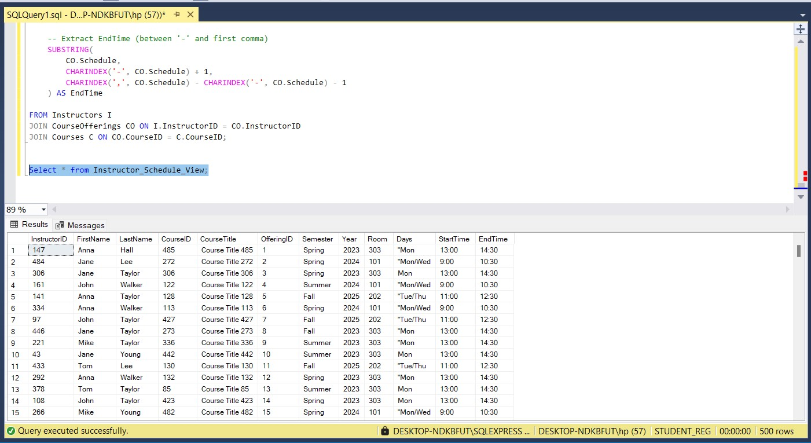

## Key Insight

- **Average GPA Across All Students**

```sql
SELECT 
    AVG(
        CASE E.Grade
            WHEN 'A'  THEN 4.0
            WHEN 'A-' THEN 3.7
            WHEN 'B+' THEN 3.3
            WHEN 'B'  THEN 3.0
            WHEN 'B-' THEN 2.7
            WHEN 'C+' THEN 2.3
            WHEN 'C'  THEN 2.0
            WHEN 'C-' THEN 1.7
            WHEN 'D'  THEN 1.0
            WHEN 'F'  THEN 0.0
            ELSE NULL
        END
    ) AS AverageGPA
FROM Enrollments E;
```
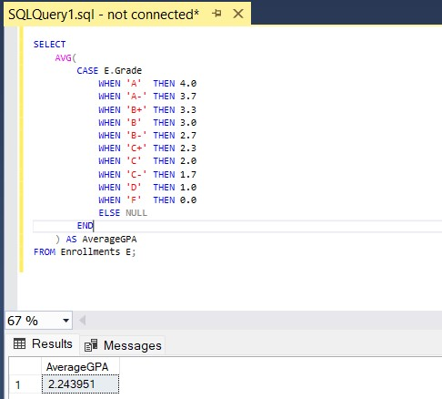

- ***Department with Highest Enrollment and GPA**
```sql
SELECT TOP 1
    C.Department,
    COUNT(E.EnrollmentID) AS TotalEnrollments,
    AVG(
        CASE E.Grade
            WHEN 'A'  THEN 4.0
            WHEN 'A-' THEN 3.7
            WHEN 'B+' THEN 3.3
            WHEN 'B'  THEN 3.0
            WHEN 'B-' THEN 2.7
            WHEN 'C+' THEN 2.3
            WHEN 'C'  THEN 2.0
            WHEN 'C-' THEN 1.7
            WHEN 'D'  THEN 1.0
            WHEN 'F'  THEN 0.0
            ELSE NULL
        END
    ) AS AverageGPA
FROM Enrollments E
JOIN CourseOfferings CO ON E.OfferingID = CO.OfferingID
JOIN Courses C ON CO.CourseID = C.CourseID
GROUP BY C.Department
ORDER BY TotalEnrollments DESC;
```
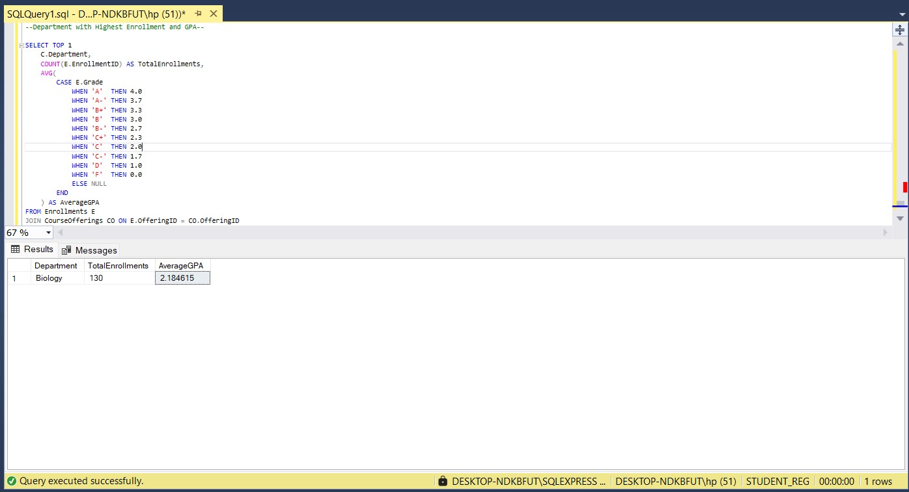

- ***Percentage of Under-Enrolled Offerings per Semester**

```sql
WITH OfferingCounts AS (
    SELECT 
        CO.OfferingID,
        CO.Semester,
        COUNT(E.StudentID) AS EnrollmentCount
    FROM CourseOfferings CO
    LEFT JOIN Enrollments E ON CO.OfferingID = E.OfferingID
    GROUP BY CO.OfferingID, CO.Semester
),
AverageEnrollment AS (
    SELECT 
        AVG(EnrollmentCount * 1.0) AS AvgEnrollment
    FROM OfferingCounts
),
UnderEnrolledSemesters AS (
    SELECT 
        Semester,
        COUNT(*) AS UnderEnrolled
    FROM OfferingCounts, AverageEnrollment
    WHERE EnrollmentCount < AvgEnrollment
    GROUP BY Semester
),
TotalSemesters AS (
    SELECT 
        Semester,
        COUNT(*) AS TotalOfferings
    FROM OfferingCounts
    GROUP BY Semester
)
SELECT 
    T.Semester,
    T.TotalOfferings,
    U.UnderEnrolled,
    ROUND((U.UnderEnrolled * 100.0) / T.TotalOfferings, 2) AS UnderEnrolledPercentage
FROM TotalSemesters T
LEFT JOIN UnderEnrolledSemesters U ON T.Semester = U.Semester
ORDER BY UnderEnrolledPercentage DESC;
```
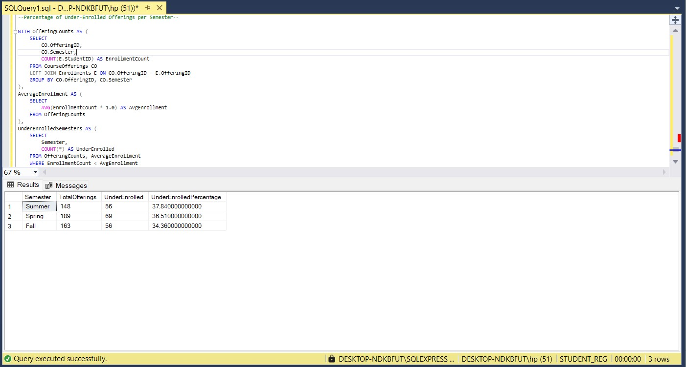

| Semester | Total Offerings | Under-Enrolled | Under-Enrolled (%) |
|----------|------------------|----------------|---------------------|
| Summer   | 148              | 56             | 37.84%              |
| Spring   | 189              | 69             | 36.51%              |
| Fall     | 163              | 56             | 34.36%              |


- ***Percentage of Under-Enrolled Offerings per Semester**

```sql
SELECT 
    Department,
    SUM(C.Credits) AS TotalCredits
FROM 
    Courses C
GROUP BY Department
ORDER BY TotalCredits DESC;
```

| Department | TotalCredit |
|------------|-------------|
| Biology    | 345         |
| Math       | 323         |
| CS         | 304         |
| Physics    | 269         |

- ***Which course has the highest enrollment?**
  
```sql
SELECT Top 3
    C.CourseID,
    C.Title,
    COUNT(E.StudentID) AS TotalEnrolled
FROM 
    Courses C
JOIN CourseOfferings CO ON C.CourseID = CO.CourseID
JOIN Enrollments E ON CO.OfferingID = E.OfferingID
GROUP BY C.CourseID, C.Title
ORDER BY TotalEnrolled DESC;
```

| CourseID | Title             | TotalEnrolled |
|----------|-------------------|----------------|
| 97       | Course Title 97   | 14             |
| 74       | Course Title 74   | 10             |
| 336      | Course Title 336  | 10             |

- ***Which instructors have taught the most students overall?**

```sql
SELECT TOP 6
    I.InstructorID,
    I.FirstName,
    I.LastName,
    COUNT(E.StudentID) AS TotalStudentsTaught
FROM 
    Instructors I
JOIN CourseOfferings CO ON I.InstructorID = CO.InstructorID
JOIN Enrollments E ON CO.OfferingID = E.OfferingID
GROUP BY I.InstructorID, I.FirstName, 
```
| InstructorID | FirstName | LastName | TotalStudenttauhjt |
|--------------|-----------|----------|---------------------|
| 493          | Jane      | Young    | 8                   |
| 327          | Jane      | Lee      | 6                   |
| 198          | John      | Lee      | 5                   |
| 220          | Sara      | Lee      | 5                   |
| 314          | John      | Hall     | 5                   |
| 325          | Mike      | Young    | 5                   |


- ***Which semesters had the highest average GPA?**

```sql
SELECT 
    CO.Semester,
    ROUND(SUM(
        CASE E.Grade
            WHEN 'A'  THEN 4.0
            WHEN 'A-' THEN 3.7
            WHEN 'B+' THEN 3.3
            WHEN 'B'  THEN 3.0
            WHEN 'B-' THEN 2.7
            WHEN 'C+' THEN 2.3
            WHEN 'C'  THEN 2.0
            WHEN 'C-' THEN 1.7
            WHEN 'D'  THEN 1.0
            WHEN 'F'  THEN 0.0
        END * C.Credits
    ) / SUM(C.Credits), 2) AS AvgGPA
FROM 
    CourseOfferings CO
JOIN Enrollments E ON CO.OfferingID = E.OfferingID
JOIN Courses C ON CO.CourseID = C.CourseID
GROUP BY CO.Semester
ORDER BY AvgGPA DESC;

```

| Semester | AvgGPA   |
|----------|----------|
| Summer   | 2.400000 |
| Fall     | 2.290000 |
| Spring   | 2.120000 |


- ***How many students are majoring in each department?**
  
```sql
SELECT 
    Major,
    COUNT(*) AS TotalStudents
FROM 
    Students
GROUP BY Major
ORDER BY TotalStudents DESC;
```

| Major        | TotalStudents |
|--------------|----------------|
| Math         | 165            |
| Physics      | 127            |
| Biology      | 110            |
| CS           | 97             |
| Biochemistry | 1              |

- ***Which students have taken the most courses?**

```sql
SELECT Top 6 
    S.StudentID,
    S.FirstName,
    S.LastName,
    COUNT(E.EnrollmentID) AS CoursesTaken
FROM 
    Students S
JOIN Enrollments E ON S.StudentID = E.StudentID
GROUP BY S.StudentID, S.FirstName, S.LastName
ORDER BY CoursesTaken DESC;
```

| StudentID | FirstName | LastName | CoursesTaken |
|-----------|-----------|----------|---------------|
| 26        | Fiona     | Jones    | 5             |
| 323       | Diana     | Jones    | 5             |
| 330       | Hannah    | Jones    | 4             |
| 216       | Edward    | Williams | 4             |
| 359       | Alice     | Jones    | 4             |
| 466       | George    | Johnson  | 4             |


## Challenges and Limitations

### Data Quality Issues

- Missing Values: Some records had incomplete data (e.g., NULL values in key fields).

- Inconsistent Formats: Dates, text fields, and identifiers were not uniformly formatted.

- Duplicates: Manual data generation sometimes led to unintentional duplicate entries.

### Manual Data Generation

- Creating realistic but synthetic data was time-consuming and prone to errors.

- Balancing data distributions (e.g., students per course) required extra attention.

### SQL Limitations

- SQL lacks native support for complex statistical operations or deep analytical processing.

- String manipulation (e.g., extracting data from Schedule strings) can be tedious and error-prone.

### Error Handling in Bulk Inserts

- Bulk loading CSVs into SQL often raised conversion issues due to:

- Quoted numbers

- Special characters or BOM

- Data type mismatches (e.g., trying to insert text into INT fields)

### Database Design Constraints

- Deciding between normalization and performance trade-offs.

- Managing foreign key relationships during inserts and deletes.


## Conclusion
Summarize what you achieved, what went well, and what could be improved.

## Future Work / Recommendations

- Integrate with front-end UI

- Add stored procedures and triggers

- Real-time dashboard using BI tools
  
- Add waitlist functionality for full courses
  
- Implement term-based GPA tracking
  
- Add auditing for grade changes
  
- Develop predictive models for course demand
  
- Having rich sample data ensures better testing


